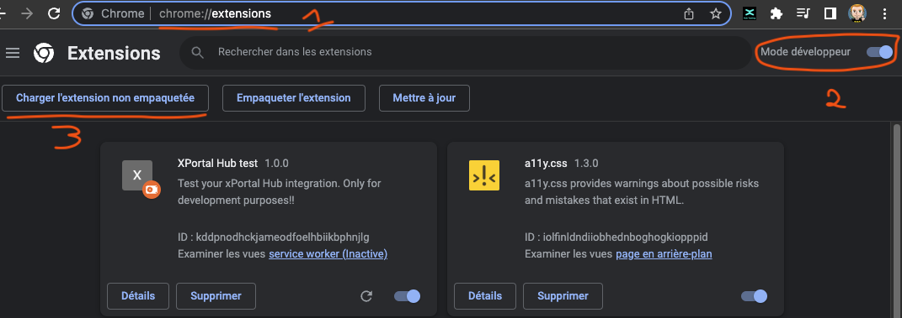
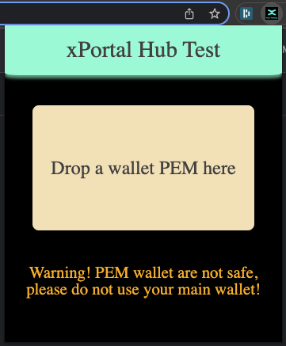
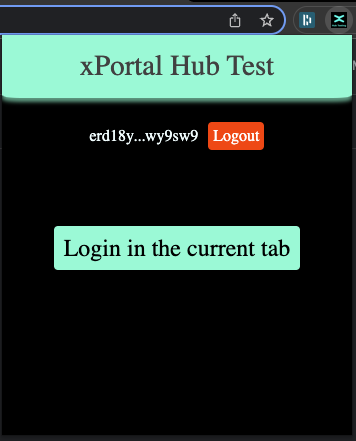
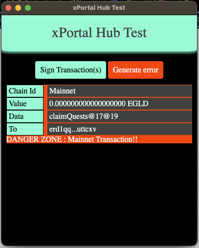

# mx-xportalhub-chrome

Chrome extension for **testing** XportalHub integration.

If you are curious about how XportalHub integration works, you can have more informations in the [XportalHub integration](docs/XPortalHub-integration.md) doc.

## Installation

Download the [latest release](https://github.com/stephaneLeroy/mx-xportalhub-chrome/releases/download/v1.0.0/mx-xportalhub-extension-1.0.0.zip) of the extension.
Unzip the file.

In Chrome, go to `chrome://extensions/` and enable `Developer mode` in the top right corner. You should see a new button `Load unpacked`. Click on it and select the folder `mx-xportalhub-extension-1.0.0`.



### Usage

In the top right corner of your browser, you should see a new icon. Click on it to open the extension.

The first step is to drop a PEM wallet file in the drop zone. You can generate a new one by following [MultiversX docs](https://docs.multiversx.com/sdk-and-tools/sdk-py/deriving-the-wallet-pem-file).

***Warning! a PEM file is the less secure way to handle private keys. You should use it only for testing purpose.***



You can now login the current tab by hitting the `login in the current tab` button. This generate a new native token from the wallet and add it to the current url.



Then use your dapp as usual. When transactions signature is requested, a popup will appear. You can sign transactions by clicking on the `Sign` button or generate an error.



***As shown in the screenshot, Mainnet transactions are highlight to avoid signing them without noticing***

## Development : Project Setup

Install dependencies
```sh
npm install
```

Compile and Hot-Reload for Development
```sh
npm run dev
```

Type-Check, Compile and Minify for Production
```sh
npm run build
```

Lint with [ESLint](https://eslint.org/)
```sh
npm run lint
```
