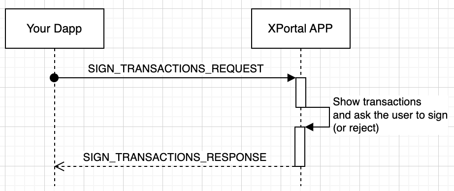

# XPortal Hub integration

Here are the informations that I think I have understand by reverse engineering the dapp sdk. (If a core team member read this, please correct me if I'm wrong)

# Workflows

## Login

XPortal Hub uses [native token authentication](https://github.com/multiversx/mx-sdk-js-native-auth-client). Which is a JWT like token signed with the user private key. You can generate or decode one on [utils.multiversx.com](https://utils.multiversx.com/auth?network=devnet)

The token is generated and added to the current url as a query parameter `accessToken`.

The integration must check if the `accessToken` is present in the url and if it is, it must verify the token signature and token payload (like timestamp to manage expiration).

# Sign Transactions

XPortal Hub use [message API](https://developer.mozilla.org/en-US/docs/Web/API/Window/postMessage) to communicate with the dapp.



Message are formatted in JSON :
```json
Request transactions signature
{
  "type": "SIGN_TRANSACTIONS_REQUEST",
  "message": [list of transactions to sign]
}

Response with signed transactions
{
  "type": "SIGN_TRANSACTIONS_RESPONSE",
  "message": {
    "transactions": [list of signed transactions],
    "errors": If an error occured. In this case 'transactions' is not present
  }
}
```